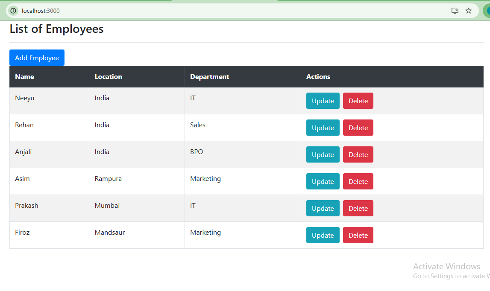
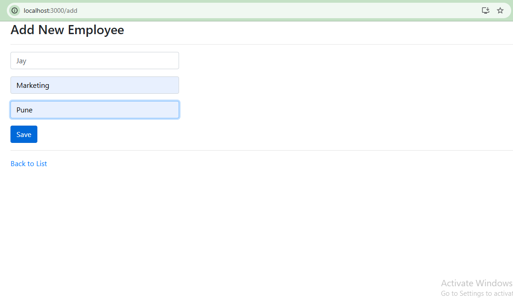
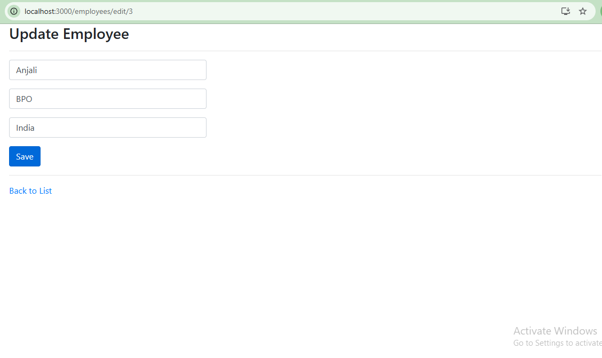

# Employee Management System

A Full Stack Employee Management System built using React.js, Spring Boot, and MySQL.

## Technologies Used

Frontend:
- React.js
- React Router
- Axios
- Bootstrap

Backend:
- Spring Boot
- Spring Data JPA
- REST API

Database:
- MySQL

## Features

- Add Employee
- View Employee List
- Update Employee
- Delete Employee

## Application Screenshots

### Employee List Page

### Add Employee Page

### Update Employee Page

## Project Structure

employee-management-system
│
├── Backend
│   └── springbootrestapi
│
└── Frontend
    └── react-workspace

## Author

Neeyu Vaidhya
